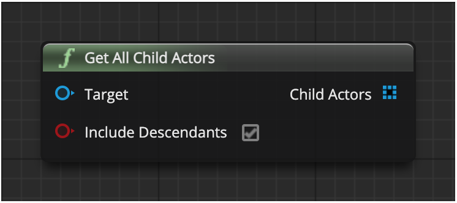

# Get All Child Actors 
获取所有子 Actor

返回一个由所有子 Actor 组件派生的 Actors 列表，包括 children of children。不返回子数组的内容。

操作对象是 Actor

## 输入
| 引脚 | 参数 | 类型 | 描述 |
| -- | -- | -- | -- |
| <IconPin color="#00a8f4"/> | Target | Actor Object Reference | 场景组件的对象引用 |
| <IconPin color="#af0e0e"/> | Include Descendants | Boolean | 是否包含子代的子代 |

## 输出
| 引脚 | 参数 | 类型 | 描述 |
| -- | -- | -- | -- |
| <IconArray color="#00a8f4"/> | Child Actors | Array of Actor Object References | Actor 数组 |