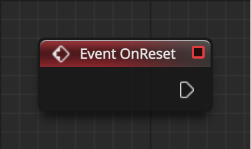

# Event OnReset

当 Actor 重置为初始状态时触发 - 用于重启关卡时，非重新载入关卡。

操作对象是 Actor

 =265x)

## 输入
| 引脚 | 参数 | 类型 | 描述 |
| -- | -- | -- | -- |

## 输出
| 引脚 | 参数 | 类型 | 描述 |
| -- | -- | -- | -- |
| <IconDelegate /> | Output Delegate | Delegate | 委托，一般被受托方调用。|
| <IconExec /> | Out | Exec | 