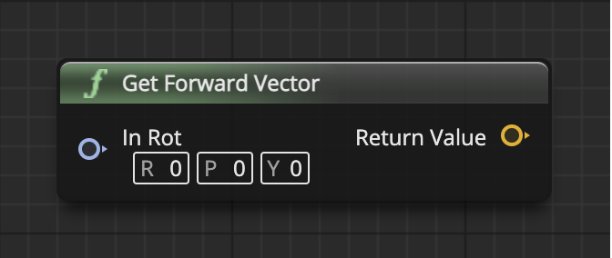

# GetForwardVector

返回场景组件在世界中的坐标

参数是场景组件（Scene Component）

## 输入
| 引脚 | 参数 | 类型 | 描述 |
| -- | -- | -- | -- |
| <IconPin color="#00a8f4"/> | Target | 场景组件的对象引用 |  |

## 输出
| 引脚 | 参数 | 类型 | 描述 |
| -- | -- | -- | -- |
| <IconPin color="#fac426"/> | Return Value | Vector 向量 | 返回场景组件在世界中的坐标 |