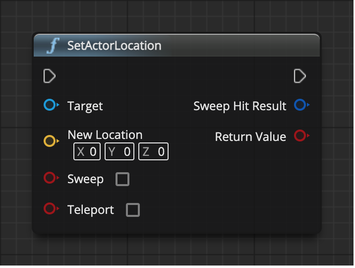

# SetActorLocation

Move the Actor to the specified location.

操作对象是 Actor

## 输入
| 引脚 | 参数 | 类型 | 描述 |
| -- | -- | -- | -- |
| <IconExec/> | In | Exec |  |
| <IconPin color="#00a8f4"/> | Target | Actor Object Reference | Actor 的对象引用 |
| <IconPin color="#fac426"/> | New Location | Vector | 指定 Actor 的新位置 |
| <IconPin color="#af0e0e"/> | Sweep | Boolean | 是否扫描到目标位置的碰撞检测，沿途将触发重叠；如果遭遇阻拦，则中途停止。只会对根组件进行扫描检测并检查阻挡碰撞，子组件的移动与扫描无关。碰撞关闭时该参数不生效 |
| <IconPin color="#af0e0e"/> | Teleport | Boolean | 是否传送物理状态（如果此对象启用了物理碰撞）。如果为 true，此对象的物理速度不发生改变（因此布偶部件不受位置改变所影响，没有物理速度，就不会产生物理惯性），如果为 false，物理速度将基于位置变化更新（影响布偶部件，会观察到物理惯性）。如果 CCD（Continuous Collision Detection，连续碰撞检测） 开启且为传送，则整个扫描范围中的对象都将受影响。 |

## 输出
| 引脚 | 参数 | 类型 | 描述 |
| -- | -- | -- | -- |
| <IconExec/> | Out | Exec |  |
| <IconPin color="#0057c5" /> | Sweep Hit Result | Hit Result Structure | 如果 sweep 设置为 true，当检测到移动路径上有碰撞时，返回碰撞结果结构体 |
| <IconPin color="#af0e0e" /> | Return Value | Boolean | 位置是否已成功设置（sweep = false 时）。或已发生移动（sweep = true 时） |
